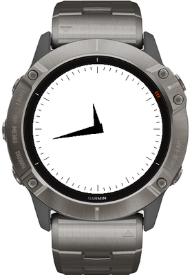
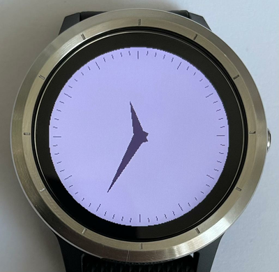

# connectiq-xclock

garmin connect iq watchface that tires to replicate the looks of the classic clock application for x11. it's not pixel-perfect but should be good enough  

[original xclock source code](https://gitlab.freedesktop.org/xorg/app/xclock/)  

## incompatible watches

watches listed below are incompatible because of their screen dimensions. i was not able to figure out how to position the watch face correctly on those 

* fr630
* fr230
* fr235 
* fr735xt
* fr920xt 
* vivoactive 
* vivoactive_hr 
* epix 

## license

MIT

